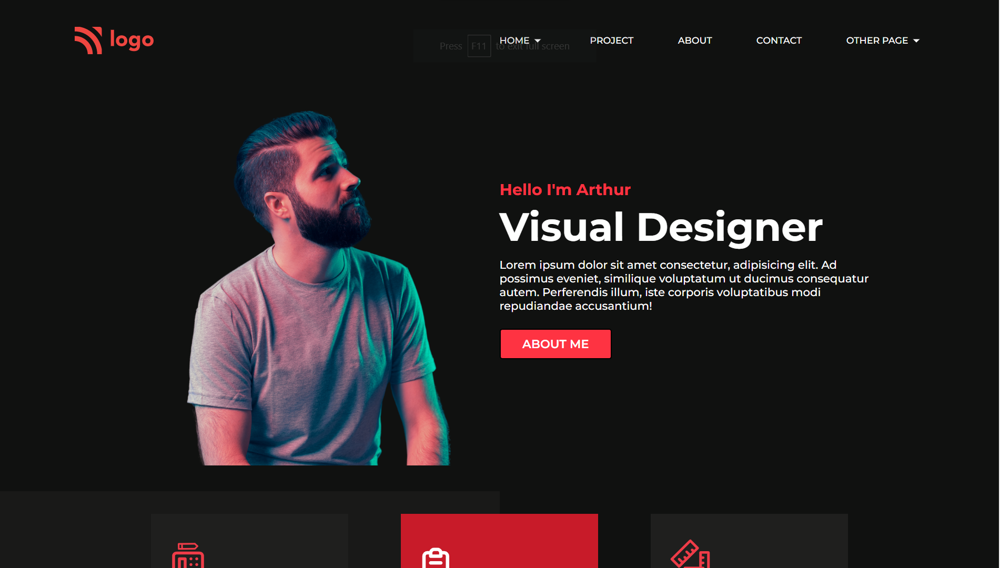
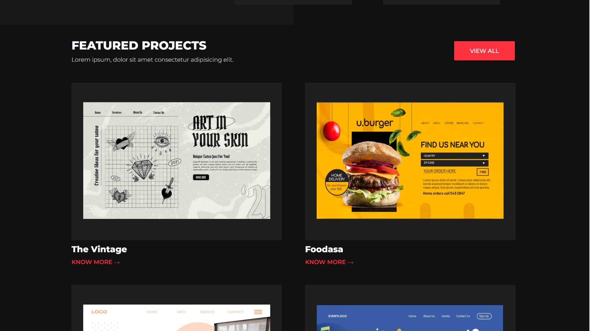
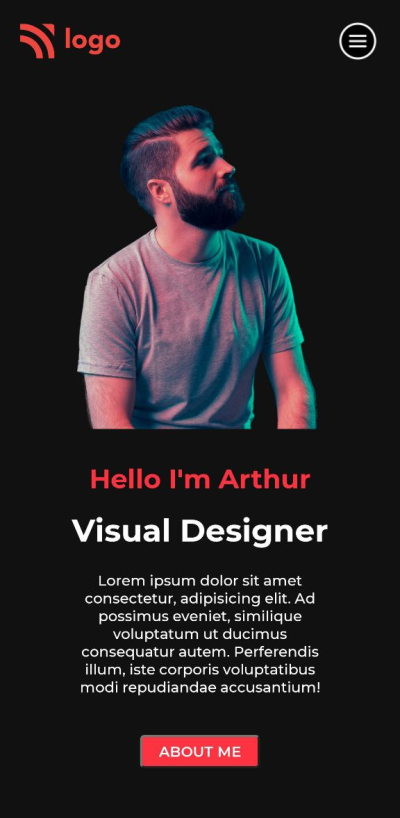
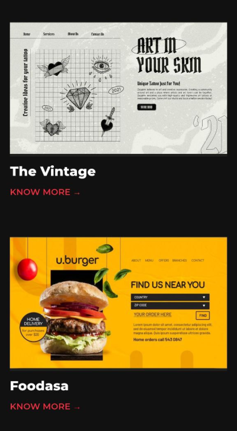
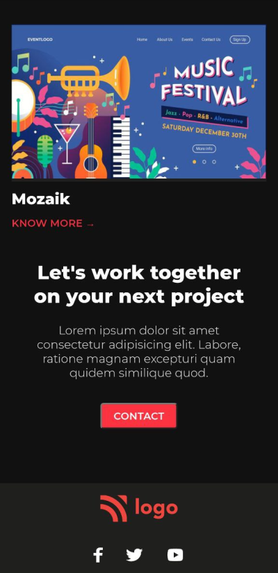

# Visual designer's landing page

**Name :**  Shivam Sharma

**Time taken :**  8-9 hrs

**Key learning :** 

- Learned more about flexbox properties like: Gap, align-self, flex-wrap.
- Adjusting images size according to screen size.

**Technology Used :**

**Deployed On :** 

## **Screenshots :**

### **Web Version :-**

&nbsp;

&nbsp;

&nbsp;
&nbsp;

### **Mobile Version :-**

&nbsp;

&nbsp;

&nbsp;

&nbsp;

&nbsp;

## **🔗 Links**

